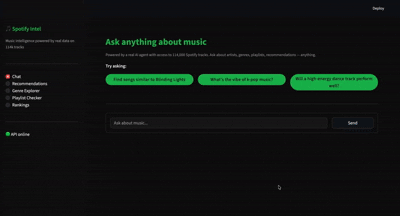
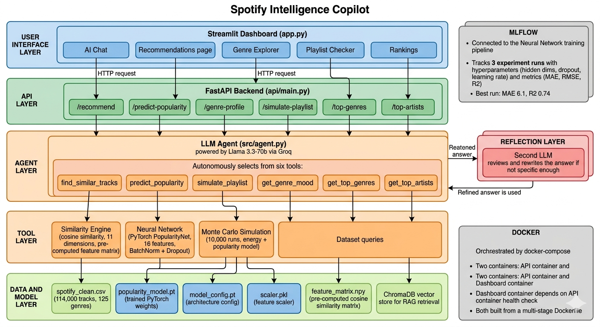

# Spotify Intelligence Copilot

An agentic AI system that answers music questions in plain English, finds similar tracks, analyses genre moods, and predicts whether a playlist will keep listeners engaged. Built on 114,000 real Spotify tracks across 125 genres.



## What it does

Most music apps show you charts. This one reasons about music.

When you ask a question, the agent decides which tools to call, pulls the relevant data, runs the right models, and puts together a real answer. A second LLM then reads that answer and rewrites it if it is too vague or missing specifics.

Some examples of what you can ask:

**"Make me a late night drive playlist and tell me if people would actually listen to the whole thing"**
The agent picks suitable tracks, runs 10,000 Monte Carlo simulations on the playlist, and tells you the finish rate, which track people drop off at, and whether the order is working.

**"Find me songs similar to Blinding Lights"**
The agent runs cosine similarity across an 11 dimensional audio feature space and returns the closest matches with similarity scores. Not a genre filter, actual ML.

**"What is the vibe of synthwave music?"**
The agent profiles the genre across all tracks in the dataset, energy, danceability, valence, classifies its mood, and surfaces the top artists.

**"Would a slow acoustic sad song perform well on Spotify?"**
The agent feeds the audio characteristics into a trained PyTorch neural network and returns a predicted popularity score with a confidence range.

**"What are the hottest genres right now?"**
The agent queries the full dataset, ranks genres by average popularity, and gives you energy and danceability breakdowns alongside the numbers.

Every answer is computed from real data at query time. Nothing is hardcoded.

## Architecture

<div align="center">
  
</div>

### Text Walkthrough

```
User question
      │
      ▼
┌─────────────────────────────────────────┐
│  Streamlit Dashboard (app.py)           │
│  Chat, Recommendations, Genre Explorer  │
│  Playlist Checker, Rankings             │
└──────────────────┬──────────────────────┘
                   │ HTTP requests
                   ▼
┌─────────────────────────────────────────┐
│  FastAPI Backend (api/main.py)          │
│  /recommend        /predict-popularity  │
│  /genre-profile    /simulate-playlist   │
│  /top-genres       /top-artists         │
└──────────────────┬──────────────────────┘
                   │
                   ▼
┌─────────────────────────────────────────┐
│  LLM Agent (src/agent.py)               │
│  Llama 3.3-70b via Groq                 │
│  autonomously selects tools to call     │
└──────────────────┬──────────────────────┘
                   │
      ┌────────────┼─────────────┐
      ▼            ▼             ▼
┌──────────┐ ┌──────────┐ ┌──────────────┐
│ Neural   │ │Similarity│ │ Monte Carlo  │
│ Network  │ │ Engine   │ │ Simulation   │
│ PyTorch  │ │ cosine   │ │ 10k runs     │
│ 16 feats │ │ 11 dims  │ │ per query    │
└────┬─────┘ └────┬─────┘ └──────┬───────┘
     └────────────┴──────────────┘
                   │
                   ▼
┌─────────────────────────────────────────┐
│  Data and Model Layer                   │
│  spotify_clean.csv  114k tracks         │
│  popularity_model.pt  trained weights   │
│  feature_matrix.npy  similarity matrix  │
│  scaler.pkl  label_encoder.pkl          │
└──────────────────┬──────────────────────┘
                   │
                   ▼
┌─────────────────────────────────────────┐
│  Reflection Layer                       │
│  second LLM reviews every answer        │
│  rewrites if too vague or missing data  │
└──────────────────┬──────────────────────┘
                   │
                   ▼
            Final answer
```

## How we used the data

The dataset gives you 114,000 tracks with audio features and a popularity score but no timestamps, no user behaviour, no play counts. Just a snapshot. That rules out time series forecasting and collaborative filtering, which are the two most common approaches in music ML.

The actual problem we solved was this: can you predict popularity from sound alone, and can you find tracks that sound alike without knowing what people actually listened to together?

For popularity prediction we treated it as a regression problem. Raw audio features alone were not enough, so we engineered three composite features. The mood score captures emotional tone by weighting valence and energy. The dance energy captures physical intensity as the product of danceability and energy. The acoustic score captures whether a track feels acoustic or electronic. Combined with genre and artist context that gave us 16 input features total. We trained a neural network with BatchNorm and Dropout, tracked three runs in MLflow, and landed at MAE 6.1 and R² 0.74. Given just the audio fingerprint of a song, the model can predict its Spotify popularity within about 6 points.

For recommendations we built an 11 dimensional audio feature vector per track, scaled it, and pre-computed the full cosine similarity matrix across all 114k tracks. At query time it is a single matrix lookup, under 100ms. No user history needed, similarity is computed purely from how tracks sound.

For the playlist simulation we only needed two signals per track: popularity and energy. For each track we compute a retention probability, base 60% chance the listener stays, plus 30% for popular tracks, minus 20% if the energy jumps sharply from the previous track. Run that 10,000 times and you get a statistically grounded prediction of how many people finish the playlist and where they drop off.

## Feature engineering

```
Raw Spotify dataset (114k tracks, 125 genres)
        │
        ▼
┌───────────────────────────────────────────────┐
│  Audio features from dataset                   │
│  danceability, energy, loudness, speechiness,  │
│  acousticness, instrumentalness, liveness,     │
│  valence, tempo                                │
├───────────────────────────────────────────────┤
│  Engineered features                           │
│  mood_score     = valence×0.6 + energy×0.4    │
│  dance_energy   = danceability × energy        │
│  acoustic_score = acousticness×0.7 +           │
│                   (1 - energy)×0.3             │
├───────────────────────────────────────────────┤
│  Contextual features                           │
│  genre_avg_popularity, artist_avg_popularity   │
└───────────────────────────────────────────────┘
              16 features total into PopularityNet
```

## FastAPI backend

The Streamlit dashboard never touches the ML models directly. Everything goes through the FastAPI backend at api/main.py and that separation matters for a real reason.

Streamlit reruns the entire script on every interaction. If the model loaded inside Streamlit it would reload on every button click. By putting everything behind a FastAPI server the model loads once at startup and stays in memory. Every request after that is just an HTTP call to an already warm model.

The API uses FastAPI's lifespan event to load the neural network, scaler, and feature matrix at boot time. If any model file is missing the server refuses to start and logs a clear error. It fails loudly at startup rather than silently 500ing on every request later.

```python
@asynccontextmanager
async def lifespan(app: FastAPI):
    model, FEATURES = load_nn_model(MODELS)
    nn_scaler = pickle.load(open("models/scaler.pkl", "rb"))
    yield
```

| Method | Endpoint | What it does |
|--------|----------|--------------|
| GET | /health | Returns server status, used by Docker health check |
| POST | /predict-popularity | Runs input through PopularityNet, returns score and tier |
| POST | /recommend | Cosine similarity lookup, returns top N similar tracks |
| GET | /genre-profile/{genre} | Mood classification and audio profile for a genre |
| GET | /top-genres | Top N genres ranked by average popularity |
| GET | /top-artists | Top N artists ranked by average popularity |
| POST | /simulate-playlist | Runs 10,000 Monte Carlo simulations on a track list |

FastAPI generates automatic interactive documentation. While the API is running you can open http://localhost:8000/docs and test every endpoint live from the browser with a built in Try it out button. No Postman needed.

The /predict-popularity endpoint also auto-computes the three engineered features if you do not pass them, so the agent can call it with just raw Spotify audio features and still get a valid prediction back.

## MLflow experiment tracking

Training was not a single run. We used MLflow to compare three model configurations before settling on the final architecture. Each run tracked the same hyperparameters and metrics so comparisons were clean.

```
mlflow_runs/
└── experiment/
    ├── run 1   hidden=[256,128,64]  dropout=0.3  lr=0.001  MAE 7.2   R² 0.68
    ├── run 2   hidden=[128,64,32]   dropout=0.3  lr=0.001  MAE 6.8   R² 0.71
    └── run 3   hidden=[128,64,32]   dropout=0.2  lr=0.001  MAE 6.1   R² 0.74  selected
```

What MLflow gave us that a plain training script would not is full reproducibility. Every run stores its exact hyperparameters so we can recreate any model from the log. The selected model's weights are stored alongside its run metadata, so the version that ships is provably the version that was evaluated. Anyone cloning the repo can open the MLflow UI and see exactly why run 3 was chosen over run 1.

To browse the experiment history locally:

```bash
mlflow ui --backend-store-uri mlflow_runs/
```

Open http://localhost:5000

## Docker

The project ships with a production ready Docker setup. There are two reasons this matters beyond just running in a container.

The first is reproducibility. The requirements.txt pins every dependency at an exact version. Combined with the Dockerfile this means the model that was evaluated during development is the exact model that runs in the container. No version drift, no works on my machine.

The second is service isolation. The FastAPI backend and Streamlit dashboard run as separate containers orchestrated by docker-compose. The dashboard container does not start until the API container passes its health check. If the API crashes the dashboard fails loudly rather than silently returning empty results.

```yaml
depends_on:
  api:
    condition: service_healthy
```

The Dockerfile uses a multi-stage build to keep the final image lean. Build tools like gcc that are needed to compile packages are present only in the builder stage and never make it into the final image. The app runs as a non-root user for security.

```dockerfile
FROM python:3.11-slim as builder
RUN pip install -r requirements.txt

FROM python:3.11-slim
COPY --from=builder /opt/venv /opt/venv
```

To run with Docker:

```bash
docker-compose up --build
```

API runs at http://localhost:8000 and dashboard at http://localhost:8501.

## Project structure

```
spotify_intelligence_copilot/
│
├── app.py                        Streamlit dashboard
├── api/
│   └── main.py                   FastAPI backend
│
├── src/
│   ├── agent.py                  LangChain agent, 6 tools, reflection layer
│   ├── analytics.py              data query functions
│   ├── monte_carlo.py            playlist simulation engine
│   ├── neural_net.py             PyTorch PopularityNet model
│   └── rag.py                    ChromaDB vector store
│
├── notebooks/
│   ├── 01_explore.ipynb          EDA on Spotify dataset
│   ├── 02_features.ipynb         feature engineering
│   ├── 03_neural_network.ipynb   model training and MLflow
│   ├── 04_recommender.ipynb      cosine similarity engine
│   ├── 05_rag.ipynb              vector store setup
│   └── 06_agent.ipynb            agent development
│
├── data/
│   └── spotify_clean.csv         processed dataset
│
├── models/
│   ├── popularity_model.pt       trained neural network weights
│   ├── model_config.pt           architecture config
│   ├── scaler.pkl                feature scaler
│   ├── similarity_scaler.pkl     recommendation scaler
│   └── feature_matrix.npy        pre-computed similarity matrix
│
├── mlflow_runs/                  experiment tracking, 3 runs
├── Dockerfile                    multi-stage production build
├── docker-compose.yml            service orchestration
├── .env.example                  environment template
└── requirements.txt
```

## Getting started

Set up the environment:

```bash
python3 -m venv .venv
source .venv/bin/activate
pip install -r requirements.txt
```

Get a free Groq API key at console.groq.com, then:

```bash
cp .env.example .env
```

Open .env and add:

```
GROQ_API_KEY=your-key-here
```

Run locally in two terminals:

```bash
uvicorn api.main:app --reload
```

```bash
streamlit run app.py
```

Open http://localhost:8501. Or run everything with Docker:

```bash
docker-compose up --build
```

## Model performance

| Metric | Value |
|--------|-------|
| Neural network MAE | 6.1 points |
| Neural network R² | 0.74 |
| MLflow runs tracked | 3 |
| Recommendation dimensions | 11 audio features |
| Playlist simulation runs | 10,000 per query |
| Dataset size | 114,000 tracks |
| Genres covered | 125 |

## Tech stack

| Layer | Technology |
|-------|------------|
| LLM | Llama 3.3-70b via Groq |
| Agent framework | LangChain and LangGraph |
| Neural network | PyTorch |
| Recommendation | scikit-learn cosine similarity |
| Simulation | NumPy Monte Carlo |
| Experiment tracking | MLflow |
| Vector DB | ChromaDB and sentence-transformers |
| API | FastAPI |
| Dashboard | Streamlit |
| Containerization | Docker and docker-compose |

